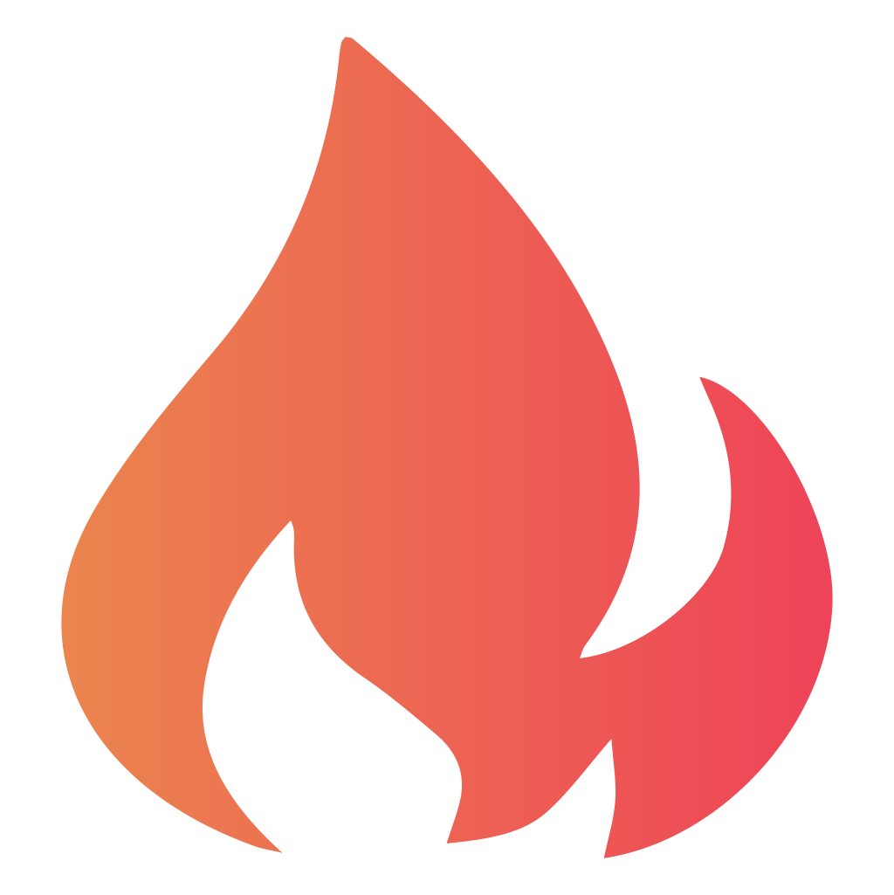
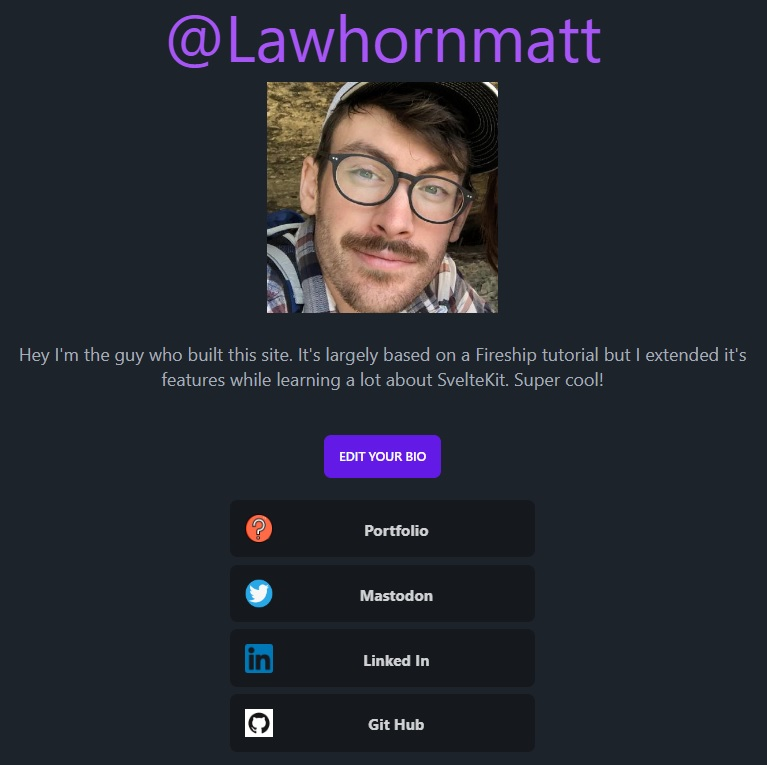

# Fireship SvelteKit Demo 
  

## TABLE OF CONTENTS:

* [Description](#description)

* [Usage Info](#usage) 

* [Questions](#questions)

* [Credits](#credit)

* [License](#license)

## DESCRIPTION:

This is the ReadMe for Matthew Lawhorn's SvelteKit demo based on the course by [Fireship](https://fireship.io/courses/sveltekit/)   

This is a full-stack application that uses:  
*  TypeScript for strong type safety and a better dev experience
*  [SvelteKit](https://kit.svelte.dev/) framework
*  [Firebase](https://firebase.google.com/) for handling the database, the storage bucket, and user authentation  
*  [Vercel](https://vercel.com/) hosting  
*  [Tailwind](https://tailwindcss.com/) & [DaisyUI](https://daisyui.com/) for rapid front-end development  

<figure>
    
    <figcaption>Screenshot of a user profile</figcaption>
</figure>  

Personally, this project was really cool. I've heard a lot of hype about SvelteKit, about it being  
many developers favourite frameworks, and it did not dissapoint. There was very little learning  
curve to writing Svelte components becuase it felt so similar to plain HTML & JavaScript.  
When things did get complicated, I found the docs well written which is nice.  
I will certainly be using it again in the future.  
  

## USAGE:

[Visit my Svelte Kit Demo with this link](https://svelte-fireship-vrcl.vercel.app/)  

## QUESTIONS:

If you have any questions,  
you can find my GitHub profile [here](https://github.com/Lawhornmatt)

## CREDIT:

This project is based on the original course by [Fireship.io](https://fireship.io)  
Go [here](https://github.com/fireship-io/fkit-course) to see the GitHub repo of their finished product  

The project in this repo was made in 2023 by Matthew Lawhorn  

## LICENSE:

This program is copyrighted under the MIT open source license.  

    Copyright 2023 Matthew Lawhorn  

    Permission is hereby granted, free of charge, to any person obtaining a copy of this software and associated documentation files (the "Software"), to deal in the Software without restriction, including without limitation the rights to use, copy, modify, merge, publish, distribute, sublicense, and/or sell copies of the Software, and to permit persons to whom the Software is furnished to do so, subject to the following conditions:
    
    The above copyright notice and this permission notice shall be included in all copies or substantial portions of the Software.
    
    THE SOFTWARE IS PROVIDED "AS IS", WITHOUT WARRANTY OF ANY KIND, EXPRESS OR IMPLIED, INCLUDING BUT NOT LIMITED TO THE WARRANTIES OF MERCHANTABILITY, FITNESS FOR A PARTICULAR PURPOSE AND NONINFRINGEMENT. IN NO EVENT SHALL THE AUTHORS OR COPYRIGHT HOLDERS BE LIABLE FOR ANY CLAIM, DAMAGES OR OTHER LIABILITY, WHETHER IN AN ACTION OF CONTRACT, TORT OR OTHERWISE, ARISING FROM, OUT OF OR IN CONNECTION WITH THE SOFTWARE OR THE USE OR OTHER DEALINGS IN THE SOFTWARE.

[Further license information can be found here.](https://opensource.org/licenses/MIT)

-- --
This ReadMe was generated by my [BoilerMaker project](https://github.com/Lawhornmatt/BoilerMaker)